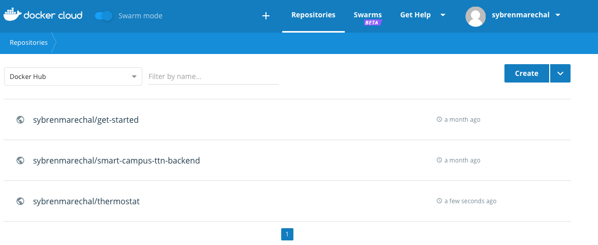
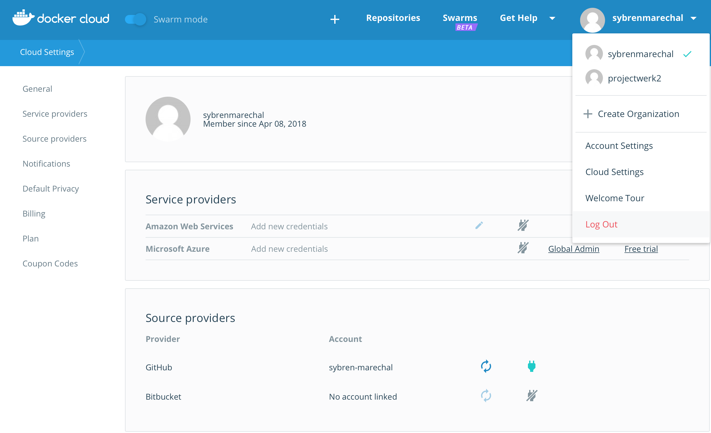

# Docker Cloud

## Connecting docker with git

Go to you settings, click on **Cloud Settings** and add your GitHub account

If you are connected you can go back to your repository and got to build

