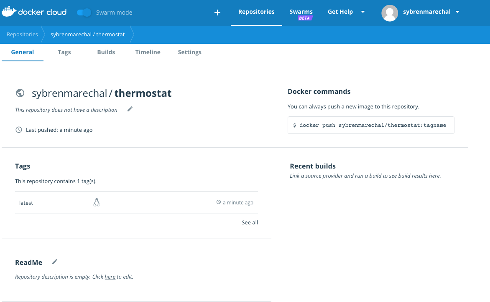
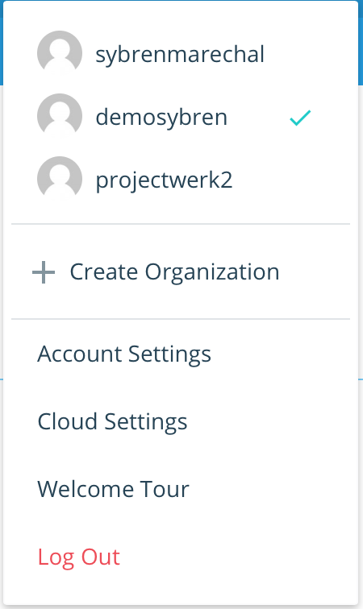

# Docker Cloud

> ## Login
>
> [https://id.docker.com/login](https://id.docker.com/login)


## Docker cloud {#docker-cloud}


## Share your image

To demonstrate the portability of what we just created, let's upload our built image and run it somewhere else. After all, you need to know how to push to registries when you want to deploy containers to production.

A registry is a collection of repositories, and a repository is a collection of images—sort of like a GitHub repository, except the code is already built. An account on a registry can create many repositories. The `docker` CLI uses Docker's public registry by default.

> **Note**: We use Docker's public registry here just because it's free and pre-configured, but there are many public ones to choose from, and you can even set up your own private registry using [Docker Trusted Registry](https://github.com/sybren-marechal/docker-starter/tree/86015b8f63a88424652425fd3d8071ca18d612a9/datacenter/dtr/2.2/guides/README.md).

### Log in with your Docker ID

If you don't have a Docker account, sign up for one at [cloud.docker.com](https://cloud.docker.com/){: target="_blank" class="_" }. Make note of your username.

Log in to the Docker public registry on your local machine.

```text
$ docker login
```

### Tag the image

The notation for associating a local image with a repository on a registry is `username/repository:tag`. The tag is optional, but recommended, since it is the mechanism that registries use to give Docker images a version. Give the repository and tag meaningful names for the context, such as `get-started:part2`. This puts the image in the `get-started` repository and tag it as `part2`.

Now, put it all together to tag the image. Run `docker tag image` with your username, repository, and tag names so that the image uploads to your desired destination. The syntax of the command is:

```text
docker tag image username/repository:tag
```

For example:

```text
docker tag thermostat sybrenmarechal/thermostat
```

Run [docker image ls](https://github.com/sybren-marechal/docker-starter/tree/86015b8f63a88424652425fd3d8071ca18d612a9/engine/reference/commandline/image_ls/README.md) to see your newly tagged image.

```text
$ docker image ls

REPOSITORY               TAG                 IMAGE ID            CREATED             SIZE
friendlyhello            latest              d9e555c53008        3 minutes ago       195MB
john/get-started         part2               d9e555c53008        3 minutes ago       195MB
python                   2.7-slim            1c7128a655f6        5 days ago          183MB
...
```

### Publish the image

Upload your tagged image to the repository:

```text
docker push username/repository:tag
```

Once complete, the results of this upload are publicly available. If you log in to [Docker Hub](https://hub.docker.com/), you see the new image there, with its pull command.



### Pull and run the image from the remote repository

From now on, you can use `docker run` and run your app on any machine with this command:

```text
docker run username/repository:tag
```

example:

```text
docker run sybrenmarechal/thermostat:latest
```

If the image isn't available locally on the machine, Docker pulls it from the repository.

```text
$ docker run sybrenmarechal/thermostat:latest
Unable to find image 'sybrenmarechal/thermostat:latest' locally
latest: Pulling from sybrenmarechal/thermostat
Digest: sha256:7d18e4d997e93e359332b939d599bb06411c6bbb2145d47e8fcd23537ebc34b6
Status: Downloaded newer image for sybrenmarechal/thermostat:latest
{
  "heating": "off",
  "airco": "on"
}
heating: false
cooling: true
```

No matter where `docker run` executes, it pulls your image, along with Python and all the dependencies from `requirements.txt`, and runs your code. It all travels together in a neat little package, and you don't need to install anything on the host machine for Docker to run it.

## Recap and cheat sheet

Here's [a terminal recording of what was covered on this page](https://asciinema.org/a/blkah0l4ds33tbe06y4vkme6g):

Here is a list of the basic Docker commands from this page, and some related ones if you'd like to explore a bit before moving on.

```text
docker build -t friendlyhello .  # Create image using this directory's Dockerfile
docker run -p 4000:80 friendlyhello  # Run "friendlyname" mapping port 4000 to 80
docker run -d -p 4000:80 friendlyhello         # Same thing, but in detached mode
docker container ls                                # List all running containers
docker container ls -a             # List all containers, even those not running
docker container stop <hash>           # Gracefully stop the specified container
docker container kill <hash>         # Force shutdown of the specified container
docker container rm <hash>        # Remove specified container from this machine
docker container rm $(docker container ls -a -q)         # Remove all containers
docker image ls -a                             # List all images on this machine
docker image rm <image id>            # Remove specified image from this machine
docker image rm $(docker image ls -a -q)   # Remove all images from this machine
docker login             # Log in this CLI session using your Docker credentials
docker tag <image> username/repository:tag  # Tag <image> for upload to registry
docker push username/repository:tag            # Upload tagged image to registry
docker run username/repository:tag                   # Run image from a registry
```

## Connecting docker with git

Go to you settings, click on **Cloud Settings** and add your GitHub account


If you are connected you can go back to your **repository** and go to **builds** and **Link to Github.**


Automated Builds have several advantages:

* Images built in this way are built exactly as specified.
* The `Dockerfile` is available to anyone with access to your Docker Hub repository.
* Your repository is kept up-to-date with code changes automatically.

Automated Builds are supported for both public and private repositories on both [GitHub](http://github.com/) and [Bitbucket](https://bitbucket.org/). This document guides you through the process of working with automated builds.  
  


## Docker organizations

Docker Hub [organizations](https://hub.docker.com/organizations/) let you create teams so you can give colleagues access to shared image repositories. A Docker cloud organization can contain public and private repositories just like a user account. Access to push or pull for these repositories is allocated by defining teams of users and then assigning team rights to specific repositories. Repository creation is limited to users in the organization owner’s group.




