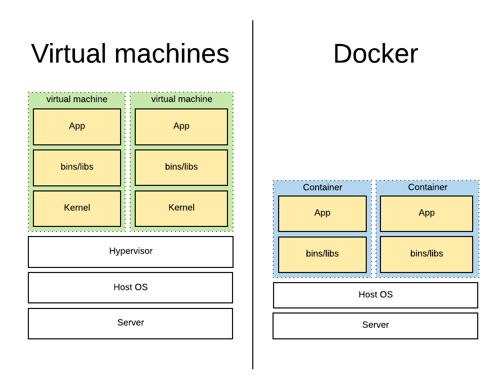

# Docker introduction

## you can find a nice introduction of docker on [this](https://vives.gitbook.io/docker/) gitbook

{% embed data="{\"url\":\"https://vives.gitbook.io/docker/\",\"type\":\"link\",\"title\":\"Docker Introduction - Docker\",\"icon\":{\"type\":\"icon\",\"url\":\"https://blobscdn.gitbook.com/v0/b/gitbook-28427.appspot.com/o/spaces%2F-LAse2WvJYHuIEXpYSUk%2Favatar.png?generation=1524590419183200&alt=media\",\"aspectRatio\":0},\"thumbnail\":{\"type\":\"thumbnail\",\"url\":\"https://www.gitbook.com/share/space/thumbnail/-LAse2WvJYHuIEXpYSUk.png\",\"aspectRatio\":0}}" %}

## 

