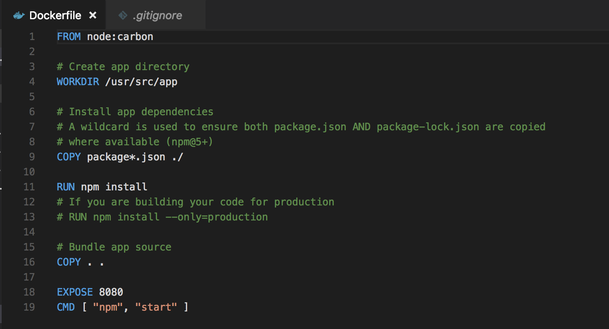

# dockerfile

## docker reference

Docker can build images automatically by reading the instructions from a `Dockerfile`. A `Dockerfile` is a text document that contains all the commands a user could call on the command line to assemble an image. Using `docker build` users can create an automated build that executes several command-line instructions in succession.

This page describes the commands you can use in a `Dockerfile`. When you are done reading this page, refer to the [`Dockerfile`Best Practices](https://docs.docker.com/engine/userguide/eng-image/dockerfile_best-practices/) for a tip-oriented guide.

## Creating a dockerfile example for node 



Create an empty file called `Dockerfile`:

```text
touch Dockerfile
```

Open the `Dockerfile` in your favorite text editor

The first thing we need to do is define from what image we want to build from. Here we will use the latest LTS \(long term support\) version `carbon` of `node` available from the [Docker Hub](https://hub.docker.com/):

```text
FROM node:carbon
```

Next we create a directory to hold the application code inside the image, this will be the working directory for your application:

```text
# Create app directory
WORKDIR /usr/src/app
```

This image comes with Node.js and NPM already installed so the next thing we need to do is to install your app dependencies using the `npm` binary. Please note that if you are using `npm` version 4 or earlier a `package-lock.json` file will _not_ be generated.

```text
# Install app dependencies
# A wildcard is used to ensure both package.json AND package-lock.json are copied
# where available (npm@5+)
COPY package*.json ./

RUN npm install
# If you are building your code for production
# RUN npm install --only=production
```

Note that, rather than copying the entire working directory, we are only copying the `package.json` file. This allows us to take advantage of cached Docker layers. bitJudo has a good explanation of this [here](http://bitjudo.com/blog/2014/03/13/building-efficient-dockerfiles-node-dot-js/).

To bundle your app's source code inside the Docker image, use the `COPY` instruction:

```text
# Bundle app source
COPY . .
```

Your app binds to port `8080` so you'll use the `EXPOSE` instruction to have it mapped by the `docker` daemon:

```
EXPOSE 8080
```

Last but not least, define the command to run your app using `CMD` which defines your runtime. Here we will use the basic `npm start` which will run `node server.js` to start your server:

```
CMD [ "npm", "start" ]
```

Your `Dockerfile` should now look like this:



```text
FROM node:carbon

# Create app directory
WORKDIR /usr/src/app

# Install app dependencies
# A wildcard is used to ensure both package.json AND package-lock.json are copied
# where available (npm@5+)
COPY package*.json ./

RUN npm install
# If you are building your code for production
# RUN npm install --only=production

# Bundle app source
COPY . .

EXPOSE 8080
CMD [ "npm", "start" ]
```




