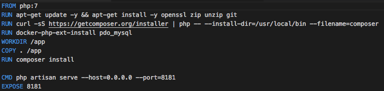
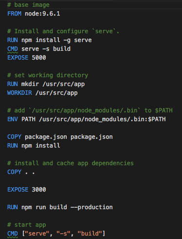

# dockerfile

## docker reference

Docker can build images automatically by reading the instructions from a `Dockerfile`. A `Dockerfile` is a text document that contains all the commands a user could call on the command line to assemble an image. Using `docker build` users can create an automated build that executes several command-line instructions in succession.

This page describes the commands you can use in a `Dockerfile`. When you are done reading this page, refer to the [`Dockerfile`Best Practices](https://docs.docker.com/engine/userguide/eng-image/dockerfile_best-practices/) for a tip-oriented guide.

## Creating a dockerfile for Ruby

Create an empty file in your project called `Dockerfile`:


```text
touch Dockerfile
```

Open the `Dockerfile` in your favorite text editor

The first thing we need to do is define from what image we want to build from. Here we will use the  version `2.5` of `ruby` available from the [Docker Hub](https://hub.docker.com/):

```text
FROM ruby:2.5
```

Next we create a directory to hold the application code inside the image, this will be the working directory for your application:

```text
# Create app directory
WORKDIR /usr/src/app
```

the following code **Copies files and directories** from the host file system to the image. 

```text
COPY Gemfile Gemfile.lock ./
COPY thermostat.gemspec thermostat.gemspec
```


you will need to change `thermostat.gemspec` to your own .`gemspec` filename.


 "RUN" Allows the **execution of commands in the shell**. This is for example used to install applications, libraries or other dependencies. Each `RUN` instruction will execute any commands in a new layer on top of the current image and commit the results

```text
RUN bundle install
```

To bundle your app's source code inside the Docker image, use the `COPY` instruction:

```text
# Bundle app source
COPY . .
```

Last but not least, define the command to run your app using `CMD` which defines your runtime. 

```text
   CMD ["ruby", "application.rb","23","C"]
```

Your `Dockerfile` should now look like this:



```text
FROM ruby:2.5
# throw errors if Gemfile has been modified since Gemfile.lock
RUN bundle config --global frozen 1
WORKDIR /usr/src/app
COPY Gemfile Gemfile.lock ./
COPY thermostat.gemspec thermostaat_sybren_marechal.gemspec
RUN bundle install
COPY . .
CMD ["ruby", "application.rb","23","C"]
```



## dockerfiles

Every dockerfile is simular to the working process of your project.   
You just saw an example for a node application but every project has a personal setup.






